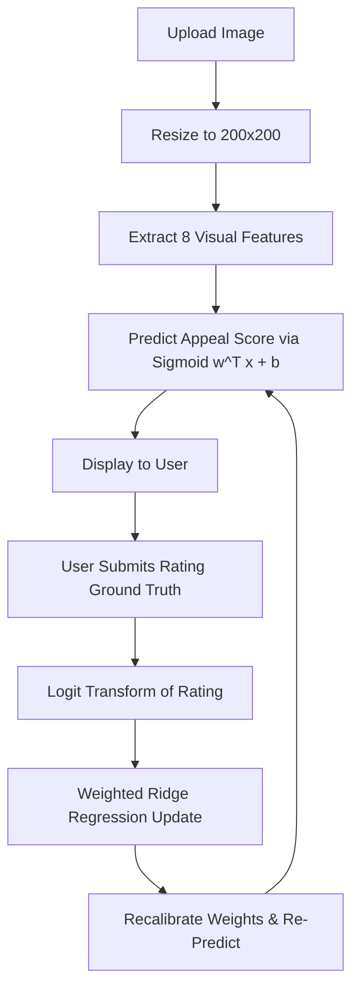

# PercepAI: Enterprise Perception Platform

PercepAI is an advanced, production-ready Single Page Application (SPA) and mobile-hybrid system designed to analyze and predict human appreciation, appeal, and perspective scores for images (specifically suited for social media and creative portfolios). 

Unlike heavy, resource-intensive deep learning networks, PercepAI utilizes **on-the-fly continuous learning** driven by a closed-form **Weighted Ridge Regression** algorithm. As users rate images, the system immediately recalculates regression coefficients globally, resulting in real-time, personalized adaptation of its scoring engine.

---

## 📖 Table of Contents
1. [Core Features](#-core-features)
2. [Mathematical & Machine Learning Architecture](#-mathematical--machine-learning-architecture)
   - [Feature Extraction Pipeline (8D)](#feature-extraction-pipeline-8d)
   - [Prediction Mechanism](#prediction-mechanism)
   - [Closed-Form Retraining Engine](#closed-form-retraining-engine)
3. [Database Architecture & Schema](#-database-architecture--schema)
4. [API Reference](#-api-reference)
   - [Authentication & Sessions](#1-authentication--sessions)
   - [Core Platform APIs](#2-core-platform-apis)
   - [Programmatic Integration API](#3-programmatic-integration-api)
   - [Administrative Control APIs](#4-administrative-control-apis)
5. [Frontend Architecture](#-frontend-architecture)
6. [Mobile Deployment (Capacitor)](#-mobile-deployment-capacitor)
7. [Installation & Setup Guide](#-installation--setup-guide)
8. [Testing & Verification](#-testing--verification)

---

## 🌟 Core Features

- **On-the-Fly Continuous Learning**: Instantly recalibrates the predictive model when user ratings (ground truth) are received.
- **8-Dimensional Feature Extraction**: Uses advanced color-space conversion (HSV), spatial gradients (Sobel-like difference), and statistical entropy to profile uploaded images.
- **Enterprise-Grade Auth & Roles**: Contains session-based authentication with `User` and `Admin` permissions.
- **Dynamic Settings & Presets**: Apply pre-set aesthetic styles (Vibrant, Minimalist, Dramatic) or calibrate hyperparameters (regularization factor $\lambda$, feedback weights) on the fly.
- **Programmatic REST API integration**: Bearer token authentication (`pat_...`) enabling external MNC clients to access the perception engine.
- **PDF Report Generation**: Exports comprehensive model, database, and prediction analytics directly to PDFs using `html2pdf.js`.
- **Hybrid Mobile Wrapper**: Structured with Capacitor configurations to build native iOS/Android packages from the same codebase.

---

## 🧮 Mathematical & Machine Learning Architecture



### Feature Extraction Pipeline (8D)

Before running predictions, images are resized to a uniform $200 \times 200$ pixels. This normalizes resolution differences and speeds up calculation. Eight distinct visual features are then extracted and normalized in the range $[0.0, 1.0]$:

1. **Brightness**: Mean intensity of the grayscale-converted image:
   $$\text{Gray} = 0.299R + 0.587G + 0.114B$$
2. **Contrast**: Standard deviation of the grayscale pixel intensities, representing overall dynamic range.
3. **Saturation**: Mean saturation value calculated in the HSV color space:
   $$S = \frac{\max(R, G, B) - \min(R, G, B)}{\max(R, G, B)}$$
4. **Warmth**: Proportion of pixels belonging to warm hues (Reds, Oranges, Yellows in $[0^\circ, 60^\circ]$ or Magenta-Reds in $[300^\circ, 360^\circ]$) with saturation $> 0.15$.
5. **Edge Density**: Average spatial gradient magnitude indicating structural details or texture levels:
   $$\text{Gradient} = |\nabla_x \text{Gray}| + |\nabla_y \text{Gray}|$$
6. **Color Entropy**: Normalized Shannon entropy of the grayscale histogram (binned into 256 intensities):
   $$H(X) = -\sum P(x_i) \log_2 P(x_i)$$
7. **Edge Contrast**: Standard deviation of spatial gradients representing image sharpness.
8. **Color Temp Balance**: Ratio of warm pixels to cool pixels (hues in $[120^\circ, 240^\circ]$), representing the image's warmth bias.

---

### Prediction Mechanism

The prediction score represents the predicted human appreciation percentage. Features are mapped to a single value in $[0.0, 100.0]$ using a Logistic Sigmoid function:

$$p = \sigma(\mathbf{w}^T \mathbf{x} + b) \times 100.0 = \frac{100.0}{1 + e^{-(\mathbf{w}^T \mathbf{x} + b)}}$$

Where:
- $\mathbf{w}$ is the 8-dimensional weight vector.
- $\mathbf{x}$ is the 8-dimensional extracted feature vector.
- $b$ is the model bias.

---

### Closed-Form Retraining Engine

To update the weights globally without gradient descent loops, the system uses closed-form **Weighted Ridge Regression** on logit-transformed rating values:

1. **Logit Transformation**: Since targets (human ratings) lie in the range $[0, 100]$, they are mapped to $(0, 1)$, clamped to $[0.01, 0.99]$ to avoid singularities, and transformed using the logit function:
   $$y_i = \ln\left(\frac{r_i}{1 - r_i}\right)$$
2. **Weighted Objective**: The system optimizes the regularized weighted sum of squared residuals:
   $$\min_{\mathbf{w}_{bias}} \sum_{i=1}^N W_i (y_i - \mathbf{x}_{bias, i}^T \mathbf{w}_{bias})^2 + \lambda \|\mathbf{w}\|^2$$
   Where:
   - $\mathbf{X}_{bias}$ is the feature matrix concatenated with a column of 1s (to include bias).
   - $\mathbf{W}$ is a diagonal matrix containing sample weights. Synthetic baseline seeds carry a weight of $1.0$, while active user feedback carries a weight of `feedback_weight` (default is $5.0$).
   - $\lambda$ is the learning penalty regularization factor (`ridge_lambda`, default is $0.5$).
3. **Closed-Form Solution**:
   $$\mathbf{w}_{bias} = \left(\mathbf{X}_{bias}^T \mathbf{W} \mathbf{X}_{bias} + \lambda \mathbf{I}^*\right)^{-1} \mathbf{X}_{bias}^T \mathbf{W} \mathbf{y}$$
   *Note: $\mathbf{I}^*$ is a modified identity matrix where the diagonal element corresponding to the bias term is set to a low value (e.g., $0.01$) to avoid regularizing the bias heavily.*

---

## 🗄️ Database Architecture & Schema

PercepAI uses a SQLite database (`percepai.db`) managed via Flask-SQLAlchemy.

```
┌────────────────────────────────────────────────────────┐
│                         users                          │
├──────────────┬──────────────────┬──────────────────────┤
│ id (PK)      │ INTEGER          │ Auto-increment       │
│ email        │ VARCHAR(255)     │ Unique, Indexed      │
│ password_hash│ VARCHAR(255)     │ Hashed (pbkdf2:sha256)│
│ role         │ VARCHAR(50)      │ 'user' or 'admin'    │
│ created_at   │ DATETIME         │ UTC Signup time      │
│ last_seen    │ DATETIME         │ Presence tracker     │
│ api_token    │ VARCHAR(255)     │ Unique API token     │
└──────────────┴──────────────────┴──────────────────────┘
       │
       ├─────────────────────────────────┐
       │ (1 to Many)                     │ (1 to Many)
       ▼                                 ▼
┌────────────────────────────────┐ ┌────────────────────────────────┐
│         image_uploads          │ │            feedback            │
├─────────────┬──────────────────┤ ├─────────────┬──────────────────┤
│ id (PK)     │ INTEGER          │ │ id (PK)     │ INTEGER          │
│ user_id (FK)│ INTEGER          │ │ image_id(FK)│ INTEGER          │
│ filename    │ VARCHAR(255)     │ │ user_id (FK)│ INTEGER          │
│ filepath    │ VARCHAR(512)     │ │ rating      │ FLOAT (0 - 100)  │
│ uploaded_at │ DATETIME         │ │ created_at  │ DATETIME (UTC)   │
│ brightness  │ FLOAT            │ │ user_ip     │ VARCHAR(45)      │
│ contrast    │ FLOAT            │ └────────────────────────────────┘
│ saturation  │ FLOAT            │
│ warmth      │ FLOAT            │
│ edge_density│ FLOAT            │
│ color_entropy│ FLOAT           │
│ edge_contrast│ FLOAT           │
│ color_temp  │ FLOAT            │
│ initial_pred│ FLOAT            │
│ avg_rating  │ FLOAT            │
│ num_ratings │ INTEGER          │
└────────────────────────────────┘
```

- **`ModelState` Table**: Stores the active parameters of the machine learning model.
  - `id` (PK, INTEGER)
  - `weights_json` (TEXT) - JSON list of the 8 feature weights.
  - `bias` (FLOAT) - Scalar model bias.
  - `mse` (FLOAT) - Overall Mean Squared Error calculated across active training samples.
  - `training_samples` (INTEGER) - Total size of the training pool (seeds + ratings).
  - `ridge_lambda` (FLOAT) - Regularization hyperparameter ($\lambda$).
  - `feedback_weight` (FLOAT) - Feedback significance modifier.
  - `updated_at` (DATETIME) - Last calibration time.

---

## 🔌 API Reference

### 1. Authentication & Sessions

| Method | Endpoint | Description | Request Payload | Response Sample |
| :--- | :--- | :--- | :--- | :--- |
| `POST` | `/api/auth/signup` | Registers a new user. The first user becomes Admin. | `{"email": "...", "password": "..."}` | `{"success": true, "user": {...}}` |
| `POST` | `/api/auth/login` | Starts session and updates `last_seen`. | `{"email": "...", "password": "..."}` | `{"success": true, "user": {...}}` |
| `POST` | `/api/auth/logout` | Clears active session cookie context. | *None* | `{"success": true}` |
| `GET` | `/api/auth/status` | Verifies active credentials. | *None* | `{"logged_in": true, "user": {...}}` |

---

### 2. Core Platform APIs

| Method | Endpoint | Description | Auth Required | Payload / Form |
| :--- | :--- | :--- | :--- | :--- |
| `POST` | `/api/upload` | Extracts features, runs prediction, saves record to DB. | User Session | Multipart Form `image: (file)` |
| `POST` | `/api/feedback` | Saves Ground Truth rating and triggers global retraining. | User Session | `{"image_id": 1, "rating": 75.5}` |
| `GET` | `/api/activity` | Pulls the 12 most recent image uploads. | User Session | *None* |
| `GET` | `/api/model-stats` | Returns current weights, bias, MSE, and tuning configuration. | User Session | *None* |
| `POST` | `/api/profile/update-password` | Updates password after verifying current credentials. | User Session | `{"current_password": "...", "new_password": "..."}` |
| `POST` | `/api/profile/request-email-otp` | Sends email OTP to verify and update user's email address. | User Session | `{"new_email": "new@domain.com"}` |
| `POST` | `/api/profile/verify-email-otp` | Confirms OTP code and commits email changes. | User Session | `{"otp": "123456"}` |

---

### 3. Programmatic Integration API

#### Predict Image Appeal (`/api/predict`)
Allows programmatic integration for external systems (e.g., MNC clients). Requires Bearer token header or query parameter `token`.
- **Method**: `POST`
- **Headers**: `Authorization: Bearer <API_TOKEN>`
- **Payload**: Multipart file field `image` containing the target file.
- **Response**:
  ```json
  {
    "success": true,
    "image_id": 42,
    "filename": "api_1700000000_photo.jpg",
    "features": {
      "brightness": 0.521,
      "contrast": 0.612,
      "saturation": 0.448,
      "warmth": 0.231,
      "edge_density": 0.352,
      "color_entropy": 0.699,
      "edge_contrast": 0.412,
      "color_temp": 0.315
    },
    "predicted_appeal_score": 68.45
  }
  ```

---

### 4. Administrative Control APIs
*(All endpoints require Admin role session authorization)*

- **`GET /api/admin/stats`**: High-level telemetry parameters (User counts, uploads, global MSE, active weights/biases).
- **`GET /api/admin/users`**: Lists users with their registration info, uploads count, ratings count, and last active description.
- **`GET /api/admin/activity`**: Aggregates all global uploads and feedback objects.
- **`DELETE /api/admin/users/<id>`**: Cascade deletes a user (removes their uploads from disk and database, deletes their ratings, and triggers global weights retraining).
- **`DELETE /api/admin/images/<id>`**: Cascade deletes an image upload file, removes related feedback, and triggers global weights retraining.
- **`GET/POST /api/admin/smtp-settings`**: Manages the system's SMTP configuration used for sending email OTPs.
- **`POST /api/model/hyperparameters`**: Updates learning penalty ($\lambda$) and feedback weight directly, immediately triggers retraining.
- **`POST /api/model/presets`**: Re-anchors model weights by applying a specific theme (`default`, `vibrant`, `minimalist`, `dramatic`).
- **`POST /api/model/reset`**: Clears all user-submitted feedback, resets model state to default factory weights, and retrains.
- **`GET /api/model/export`**: Downloads active model weights and tuning variables as a JSON file.
- **`POST /api/model/import`**: Uploads and restores model parameters from a JSON configuration file.

---

## 🎨 Frontend Architecture

The frontend is a lightweight Single Page Application structured across:
- **`templates/index.html`**: Defines the dashboard architecture, login/signup portals, profile settings menu, admin workspace sections, and the PDF-printable report template.
- **`static/css/style.css`**: Standard design tokens implementing an enterprise dark/light grid, premium glassmorphism interfaces, smooth transitions, and distinct status badges.
- **`static/js/app.js`**: Core frontend controller. Implements:
  - Session lifecycle routing (updates views based on auth status).
  - SVG progress ring animator for scores: updates `stroke-dashoffset` dynamically.
  - Form validation, Drag & Drop image file handles, and slider value outputs.
  - Dynamic table generators (fills uploader histories, admin listings, and analytics lists).
  - Live charts and PDF reports using **`html2pdf.js`** wrapper settings:
    ```javascript
    html2pdf().from(element).set({
        margin: 10,
        filename: 'percepai_analytics_report.pdf',
        image: { type: 'jpeg', quality: 0.98 },
        html2canvas: { scale: 2 },
        jsPDF: { unit: 'mm', format: 'a4', orientation: 'portrait' }
    }).save();
    ```

---

## 📱 Mobile Deployment (Capacitor)

PercepAI comes pre-packaged with **Capacitor**, enabling easy native Android and iOS wrapper compiles.
- **`capacitor.config.json`**:
  ```json
  {
    "appId": "com.percepai.app",
    "appName": "PercepAI",
    "webDir": "www",
    "bundledWebRuntime": false
  }
  ```
- **`www/` directory**: Stores the client build output (`index.html`, `js/app.js`, `css/style.css`) used by Capacitor's webview wrapper.

To synchronize changes to native assets and launch build processes:
```powershell
npx cap copy
npx cap sync
npx cap open android
```

---

## 🚀 Installation & Setup Guide

### 1. Prerequisite Installations
Ensure Python 3.8+ is installed on your local operating system.

### 2. Install Dependencies
Install Python requirements:
```bash
pip install -r requirements.txt
```
*(Dependencies: `Flask`, `Flask-SQLAlchemy`, `numpy`, `Pillow`)*

If working on mobile packaging, install node modules:
```bash
npm install
```

### 3. Initialize and Start application
Launch the server using:
```bash
python run.py
```
This script automatically:
- Creates the local `uploads/` directory.
- Bootstraps the SQLite database `percepai.db`.
- Checks for schema mismatches and updates the SQLite tables safely.
- Seeds the initial 20 synthetic baseline ratings to anchor weights.
- Registers/enforces the default system Administrator credentials:
  - **Email**: `admin@percep.ai`
  - **Password**: `admin123`
- Launches a local dev server at `http://127.0.0.1:5000`.

---

## 🧪 Testing & Verification

PercepAI has two main testing suites:

### 1. Model Unit Tests (`tests/test_model.py`)
Verifies image feature calculations, feature bounding criteria $[0.0, 1.0]$, prediction score bounds $[0.0\%, 100.0\%]$, and regression weight update behaviors.
Run using:
```bash
python -m unittest tests/test_model.py
```

### 2. Full Endpoint Integration Test Suite (`verify_endpoints.py`)
Validates all user sessions, authentication operations, OTP flows (including fallback logging), administrative deletions, and SQLite cascades.
Run using:
```bash
python verify_endpoints.py
```

### 3. Database Inspect Utility (`view_db.py`)
Run this standalone script to output a formatted terminal report showing all registered users, active model training sizes, MSE values, and total database content summaries.
Run using:
```bash
python view_db.py
```
